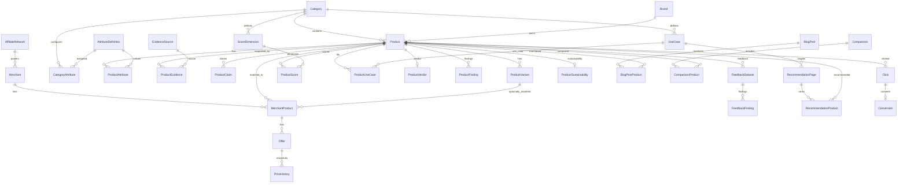

# DESKHOLT MASTER PRODUCT DATABASE v1
## Technical Database Specification — ERD, PostgreSQL/Prisma, API Contracts, Admin Product Intelligence

**Project:** Deskholt.com  
**Version:** 1.0 Architecture Specification  
**Date:** August 2026  
**Status:** Ready for implementation planning  
**Primary stack:** Next.js 15+ App Router · Prisma · PostgreSQL 16 · Redis · Cloudflare · PM2/Nginx  
**Purpose:** Mở rộng Deskholt từ affiliate catalog thành **Workspace Product Intelligence + Decision Engine** mà không phá kiến trúc affiliate/content hiện tại.

---

# 0. QUYẾT ĐỊNH KIẾN TRÚC

## 0.1. Những gì GIỮ NGUYÊN

Hệ thống hiện tại vẫn giữ:

- Next.js App Router.
- PostgreSQL + Prisma.
- Redis cho click queue/rate-limit.
- `/go/[slug]?network=...` cho affiliate redirect.
- `Click`, `Conversion`, `AffiliateNetwork`, `AffiliateReport`.
- Blog/Post + shortcode Product Card / Price Table / Comparison.
- Admin authentication, Users, Activity Log.
- Media Library/R2.
- Crawler Monitor.
- SEO Health/Sitemap.
- Pages/Legal.
- Brevo subscriber/campaign/support.
- Save → Redirect trong Admin.

Master Product Database là **domain extension**, không phải rewrite toàn site.

## 0.2. Những gì THAY ĐỔI

Model cũ:

```text
Product
├── specs Json
├── userSentiment Json
├── isSustainable Boolean
└── AffiliateLink[]
```

được nâng thành:

```text
Product Identity
├── Variants
├── Typed Attributes
├── Evidence
├── Claims
├── Merchant Products
├── Offers
├── Price History
├── Scores
├── Best-For / Use Cases
├── Editorial Findings
├── Owner Feedback
├── Sustainability Intelligence
├── Content Graph
├── Recommendation Pages
└── Comparisons
```

`Product` trở thành entity identity trung tâm, không còn là nơi nhét toàn bộ dữ liệu.

## 0.3. Nguyên tắc dữ liệu

1. **Facts ≠ Claims ≠ Editorial judgment.**
2. Dữ liệu dùng để filter/compare/rank phải có cấu trúc.
3. Mọi fact quan trọng nên có Evidence.
4. Dữ liệu merchant/price phải có timestamp/freshness.
5. Score phải có methodology/version, không nhập overall score bằng tay.
6. Best-For phải dựa trên rule + editorial override có audit trail.
7. Indexed page phải đi qua Index Gate.
8. Affiliate commission không được là tiêu chí chính cho recommendation/ranking.
9. Database có thể chứa nhiều Product hơn số Product được index.
10. Bắt đầu Standing Desk với 10 sản phẩm để kiểm nghiệm ontology trước khi scale.

---

# 1. DOMAIN MAP

```text
DESKHOLT MASTER DATABASE
│
├── IDENTITY
│   ├── Category
│   ├── Brand
│   ├── Product
│   └── ProductVariant
│
├── ATTRIBUTE ENGINE
│   ├── AttributeDefinition
│   ├── CategoryAttribute
│   └── ProductAttribute
│
├── EVIDENCE
│   ├── EvidenceSource
│   ├── ProductEvidence
│   └── ProductClaim
│
├── MARKET INTELLIGENCE
│   ├── AffiliateNetwork
│   ├── Merchant
│   ├── MerchantProduct
│   ├── Offer
│   └── PriceHistory
│
├── DECISION INTELLIGENCE
│   ├── ScoreDimension
│   ├── ProductScore
│   ├── UseCase
│   └── ProductUseCase
│
├── EDITORIAL INTELLIGENCE
│   ├── ProductVerdict
│   ├── ProductFinding
│   ├── FeedbackDataset
│   ├── FeedbackFinding
│   └── ProductSustainability
│
├── CONTENT GRAPH
│   ├── BlogPost
│   ├── BlogPostProduct
│   ├── Comparison
│   ├── ComparisonProduct
│   ├── RecommendationPage
│   └── RecommendationProduct
│
└── BUSINESS INTELLIGENCE
    ├── Click
    ├── Conversion
    ├── AffiliateReport
    └── CrawlerLog
```

---

# 2. ERD — HIGH LEVEL



---

# 3. ENUMS / CONTROLLED VOCABULARIES

Các enum dưới đây nên dùng Prisma enum hoặc PostgreSQL enum nếu team muốn strict typing.

```prisma
enum ProductStatus {
  ACTIVE
  DISCONTINUED
  UPCOMING
  ARCHIVED
}

enum IntelligenceStatus {
  DISCOVERED
  TRACKED
  QUALIFIED
  COMPLETE
}

enum EditorialStatus {
  UNREVIEWED
  RESEARCHING
  ASSESSED
  EDITORIAL_PICK
}

enum IndexStatus {
  NOINDEX
  READY
  INDEXED
  BLOCKED
}

enum AttributeDataType {
  DECIMAL
  INTEGER
  BOOLEAN
  TEXT
  ENUM
  JSON
}

enum EvidenceSourceType {
  MANUFACTURER
  MANUAL
  CERTIFICATION
  RETAILER
  DESKHOLT_TEST
  OWNER_FEEDBACK
  EDITORIAL_SOURCE
  OTHER
}

enum EvidenceConfidence {
  VERIFIED
  HIGH
  MEDIUM
  LOW
  UNVERIFIED
  CONFLICTED
}

enum ClaimType {
  MANUFACTURER_CLAIM
  RETAILER_CLAIM
  EDITORIAL_CLAIM
}

enum AvailabilityStatus {
  IN_STOCK
  OUT_OF_STOCK
  BACKORDER
  PREORDER
  UNKNOWN
}

enum ProductCondition {
  NEW
  USED
  REFURBISHED
  OPEN_BOX
  UNKNOWN
}

enum MatchingMethod {
  UPC
  EAN
  GTIN
  MPN
  MANUAL
  FUZZY
  AI_ASSISTED
}

enum FindingType {
  PRO
  CON
  NOTE
}

enum FindingImportance {
  LOW
  MEDIUM
  HIGH
  CRITICAL
}

enum RecommendationAward {
  BEST_OVERALL
  BEST_VALUE
  BEST_BUDGET
  BEST_PREMIUM
  BEST_FOR_USE_CASE
  RUNNER_UP
  ALTERNATIVE
}

enum ContentProductRelationship {
  FEATURED
  RECOMMENDED
  ALTERNATIVE
  COMPARED
  MENTIONED
  AVOID
}

enum ComparisonType {
  HEAD_TO_HEAD
  MULTI_PRODUCT
}

enum TriggerSource {
  CRON
  MANUAL
  IMPORT
  API
}
```

---

# 4. CORE IDENTITY TABLES

## 4.1. Brand

```prisma
model Brand {
  id          Int       @id @default(autoincrement())
  name        String
  slug        String    @unique
  websiteUrl  String?
  logoUrl     String?
  countryCode String?
  isActive    Boolean   @default(true)
  createdAt   DateTime  @default(now())
  updatedAt   DateTime  @updatedAt

  products    Product[]

  @@index([name])
  @@index([isActive])
}
```

## 4.2. Category

Mở rộng `Category` hiện tại; vẫn tái dùng cho Blog nếu muốn giữ quyết định cũ.

```prisma
model Category {
  id          Int       @id @default(autoincrement())
  parentId    Int?
  slug        String    @unique
  name        String
  description String?
  imageUrl    String?
  metaTitle   String?
  metaDesc    String?
  isActive    Boolean   @default(true)
  createdAt   DateTime  @default(now())
  updatedAt   DateTime  @updatedAt

  parent      Category?  @relation("CategoryTree", fields: [parentId], references: [id])
  children    Category[] @relation("CategoryTree")
  products    Product[]
  blogPosts   BlogPost[]
  attributes  CategoryAttribute[]
  scoreDims   ScoreDimension[]
  useCases    UseCase[]

  @@index([parentId])
  @@index([isActive])
}
```

Đề xuất taxonomy ban đầu:

```text
Furniture
├── Standing Desks
├── Fixed Desks
└── Chairs

Monitor & Display
├── Monitor Arms
└── Monitor Stands

Lighting
├── Desk Lamps
└── Monitor Lights

Organization
├── Cable Management
└── Desk Storage

Accessories
```

## 4.3. Product

```prisma
model Product {
  id                 Int                @id @default(autoincrement())
  brandId            Int?
  categoryId         Int
  name               String
  slug               String             @unique
  series             String?
  modelNumber        String?
  modelYear          Int?

  upcCode            String?
  eanCode            String?
  gtinCode           String?
  mpnCode            String?

  shortDescription   String?
  primaryImageUrl    String?

  productStatus      ProductStatus       @default(ACTIVE)
  intelligenceStatus IntelligenceStatus  @default(DISCOVERED)
  editorialStatus    EditorialStatus     @default(UNREVIEWED)
  indexStatus        IndexStatus         @default(NOINDEX)

  firstSeenAt        DateTime             @default(now())
  publishedAt        DateTime?
  createdAt          DateTime             @default(now())
  updatedAt          DateTime             @updatedAt

  brand              Brand?               @relation(fields: [brandId], references: [id])
  category           Category             @relation(fields: [categoryId], references: [id])
  variants           ProductVariant[]
  attributes         ProductAttribute[]
  evidence           ProductEvidence[]
  claims             ProductClaim[]
  merchantProducts   MerchantProduct[]
  scores             ProductScore[]
  useCases           ProductUseCase[]
  verdict            ProductVerdict?
  findings           ProductFinding[]
  feedbackDatasets   FeedbackDataset[]
  sustainability     ProductSustainability?
  blogMentions       BlogPostProduct[]
  comparisonRows     ComparisonProduct[]
  recommendationRows RecommendationProduct[]
  clicks             Click[]

  @@index([brandId])
  @@index([categoryId])
  @@index([productStatus])
  @@index([intelligenceStatus])
  @@index([editorialStatus])
  @@index([indexStatus])
  @@index([upcCode])
  @@index([gtinCode])
  @@index([mpnCode])
  @@index([updatedAt])
}
```

### Constraint nghiệp vụ

- `slug` unique.
- Ít nhất `name + categoryId`.
- UPC/EAN/GTIN/MPN không bắt buộc nhưng phải normalize whitespace.
- Không tự unique `upcCode` trong MVP vì có thể gặp dữ liệu lỗi/variant; entity matching service xử lý duplicate/conflict.
- `publishedAt` chỉ set khi page public thực sự publish.

## 4.4. ProductVariant

```prisma
model ProductVariant {
  id              Int      @id @default(autoincrement())
  productId       Int
  sku             String?
  variantName     String?
  sizeLabel       String?
  colorLabel      String?
  materialLabel   String?
  widthMm         Decimal? @db.Decimal(10, 2)
  depthMm         Decimal? @db.Decimal(10, 2)
  metadata        Json?
  isDefault       Boolean  @default(false)
  isActive        Boolean  @default(true)
  createdAt       DateTime @default(now())
  updatedAt       DateTime @updatedAt

  product         Product  @relation(fields: [productId], references: [id], onDelete: Cascade)
  merchantProducts MerchantProduct[]

  @@index([productId])
  @@index([isActive])
  @@unique([productId, sku])
}
```

---

# 5. ATTRIBUTE ENGINE

Mục tiêu: Standing Desk có thể có 30–40 thuộc tính mà không biến `Product` thành bảng hàng trăm columns; Chairs/Monitor Arms về sau chỉ khai báo schema attribute riêng.

## 5.1. AttributeDefinition

```prisma
model AttributeDefinition {
  id               Int               @id @default(autoincrement())
  key              String            @unique
  name             String
  description      String?
  dataType         AttributeDataType
  unitType         String?
  defaultUnit      String?
  enumOptions      Json?
  isFilterable     Boolean           @default(false)
  isComparable     Boolean           @default(false)
  isScorable       Boolean           @default(false)
  createdAt        DateTime          @default(now())
  updatedAt        DateTime          @updatedAt

  categories       CategoryAttribute[]
  values           ProductAttribute[]

  @@index([isFilterable])
  @@index([isComparable])
}
```

## 5.2. CategoryAttribute

```prisma
model CategoryAttribute {
  id                    Int                 @id @default(autoincrement())
  categoryId            Int
  attributeDefinitionId Int
  isRequired            Boolean             @default(false)
  displayOrder          Int                 @default(0)
  weightForCompleteness Decimal              @default(1) @db.Decimal(6, 3)
  minValue              Decimal?             @db.Decimal(14, 4)
  maxValue              Decimal?             @db.Decimal(14, 4)
  validationConfig      Json?

  category              Category             @relation(fields: [categoryId], references: [id], onDelete: Cascade)
  attributeDefinition   AttributeDefinition  @relation(fields: [attributeDefinitionId], references: [id], onDelete: Cascade)

  @@unique([categoryId, attributeDefinitionId])
  @@index([categoryId, displayOrder])
}
```

## 5.3. ProductAttribute

```prisma
model ProductAttribute {
  id                    Int                 @id @default(autoincrement())
  productId             Int
  attributeDefinitionId Int

  numericValue          Decimal?            @db.Decimal(18, 6)
  integerValue          Int?
  booleanValue          Boolean?
  textValue             String?
  jsonValue             Json?
  unit                  String?

  confidence            EvidenceConfidence  @default(UNVERIFIED)
  primaryEvidenceId     Int?
  verifiedAt            DateTime?
  createdAt             DateTime            @default(now())
  updatedAt             DateTime            @updatedAt

  product               Product             @relation(fields: [productId], references: [id], onDelete: Cascade)
  attributeDefinition   AttributeDefinition @relation(fields: [attributeDefinitionId], references: [id], onDelete: Cascade)
  primaryEvidence       ProductEvidence?    @relation("PrimaryAttributeEvidence", fields: [primaryEvidenceId], references: [id])

  @@unique([productId, attributeDefinitionId])
  @@index([productId])
  @@index([attributeDefinitionId])
  @@index([confidence])
}
```

### Quy tắc lưu value

Mỗi record chỉ sử dụng đúng field tương ứng `dataType`.

Ví dụ:

```text
max_height_mm      -> numericValue = 1232
motor_count        -> integerValue = 2
anti_collision     -> booleanValue = true
leg_design         -> textValue = "C_FRAME"
available_finishes -> jsonValue = ["Black", "White", "Walnut"]
```

### Không lưu đơn vị display trong value

Internal canonical unit:

- length → mm
- weight/load → kg
- speed → mm/s
- sound → dB
- warranty → months
- currency → Offer currency riêng

Frontend US convert sang inch/lb.

---

# 6. STANDING DESK ATTRIBUTE SCHEMA v1

## 6.1. Required Core

```text
desktop_width_mm
desktop_depth_mm
min_height_mm
max_height_mm
max_load_kg
adjustment_type
warranty_months
```

## 6.2. Mechanism

```text
motor_count
lifting_speed_mm_s
noise_db
anti_collision
soft_start_stop
overload_protection
memory_presets
controller_display
child_lock
controller_usb
bluetooth
mobile_app
```

## 6.3. Frame

```text
leg_count
leg_design
frame_material
crossbar
frame_width_min_mm
frame_width_max_mm
feet_width_mm
adjustable_feet
casters_compatible
```

## 6.4. Desktop

```text
desktop_included
desktop_shape
desktop_material
desktop_thickness_mm
edge_profile
available_widths_mm
available_depths_mm
available_finishes
```

## 6.5. Ergonomics / Compatibility

```text
recommended_user_height_min_cm
recommended_user_height_max_cm
wheelchair_compatible
keyboard_tray_compatible
monitor_arm_compatible
dual_monitor_suitable
ultrawide_suitable
underdesk_pc_mount_compatible
```

## 6.6. Experience

```text
assembly_time_min
assembly_difficulty
stability_at_max_height
cable_management_quality
```

Các attribute Experience phần lớn là Deskholt-derived, phải có methodology/evidence.

---

# 7. EVIDENCE LAYER

## 7.1. EvidenceSource

```prisma
model EvidenceSource {
  id           Int                @id @default(autoincrement())
  sourceType   EvidenceSourceType
  publisher    String?
  title        String?
  url          String?
  publishedAt  DateTime?
  accessedAt   DateTime           @default(now())
  trustLevel   Int                @default(50)
  metadata     Json?
  createdAt    DateTime           @default(now())
  updatedAt    DateTime           @updatedAt

  evidence     ProductEvidence[]

  @@index([sourceType])
  @@index([publisher])
}
```

`trustLevel`: 0–100 internal heuristic; không public.

## 7.2. ProductEvidence

```prisma
model ProductEvidence {
  id                 Int                @id @default(autoincrement())
  productId          Int
  sourceId           Int
  evidenceType       String
  claimKey           String?
  claimText          String?
  numericValue       Decimal?           @db.Decimal(18, 6)
  textValue          String?
  unit               String?
  excerpt            String?
  locationReference  String?
  confidence         EvidenceConfidence @default(UNVERIFIED)
  verifiedByUserId   Int?
  verifiedAt         DateTime?
  createdAt          DateTime           @default(now())
  updatedAt          DateTime           @updatedAt

  product            Product            @relation(fields: [productId], references: [id], onDelete: Cascade)
  source             EvidenceSource     @relation(fields: [sourceId], references: [id], onDelete: Cascade)
  verifiedBy         User?              @relation(fields: [verifiedByUserId], references: [id])
  primaryForAttributes ProductAttribute[] @relation("PrimaryAttributeEvidence")

  @@index([productId])
  @@index([sourceId])
  @@index([claimKey])
  @@index([confidence])
}
```

## 7.3. ProductClaim

```prisma
model ProductClaim {
  id          Int                @id @default(autoincrement())
  productId   Int
  claimType   ClaimType
  claimText   String
  sourceId    Int?
  confidence  EvidenceConfidence @default(UNVERIFIED)
  isPublic    Boolean            @default(false)
  createdAt   DateTime           @default(now())
  updatedAt   DateTime           @updatedAt

  product     Product            @relation(fields: [productId], references: [id], onDelete: Cascade)
  source      EvidenceSource?    @relation(fields: [sourceId], references: [id])

  @@index([productId])
  @@index([claimType])
}
```

### Evidence conflict rule

Nếu cùng `claimKey` có 2 verified sources với value khác nhau vượt tolerance:

```text
ProductAttribute.confidence = CONFLICTED
Index Gate critical_conflict = true nếu attribute đó required
Admin hiển thị Conflict queue
```

Không overwrite im lặng.

---

# 8. MARKET INTELLIGENCE

## 8.1. AffiliateNetwork

Giữ model hiện tại; bổ sung merchant relation.

## 8.2. Merchant

```prisma
model Merchant {
  id                 Int               @id @default(autoincrement())
  affiliateNetworkId Int?
  name               String
  slug               String            @unique
  domain             String?
  countryCode        String            @default("US")
  merchantType       String?
  reliabilityScore   Decimal?          @db.Decimal(5, 2)
  returnPolicyScore  Decimal?          @db.Decimal(5, 2)
  isActive           Boolean           @default(true)
  createdAt          DateTime          @default(now())
  updatedAt          DateTime          @updatedAt

  affiliateNetwork   AffiliateNetwork? @relation(fields: [affiliateNetworkId], references: [id])
  products           MerchantProduct[]

  @@index([affiliateNetworkId])
  @@index([isActive])
}
```

Amazon/Walmart/Target/brand DTC là Merchant. AffiliateNetwork là tracking/program provider.

## 8.3. MerchantProduct

```prisma
model MerchantProduct {
  id                 Int                 @id @default(autoincrement())
  productId          Int
  variantId          Int?
  merchantId         Int

  merchantSku        String?
  merchantProductId  String?
  productUrl         String
  affiliateUrl       String?

  matchingMethod     MatchingMethod      @default(MANUAL)
  matchingConfidence Decimal             @default(100) @db.Decimal(5, 2)

  isActive           Boolean             @default(true)
  lastCheckedAt      DateTime?
  createdAt          DateTime            @default(now())
  updatedAt          DateTime            @updatedAt

  product            Product             @relation(fields: [productId], references: [id], onDelete: Cascade)
  variant            ProductVariant?     @relation(fields: [variantId], references: [id])
  merchant           Merchant            @relation(fields: [merchantId], references: [id], onDelete: Cascade)
  offers             Offer[]

  @@index([productId])
  @@index([variantId])
  @@index([merchantId])
  @@index([lastCheckedAt])
  @@unique([merchantId, merchantProductId])
}
```

## 8.4. Offer

```prisma
model Offer {
  id                 Int                @id @default(autoincrement())
  merchantProductId  Int

  price              Decimal?           @db.Decimal(12, 2)
  currency           String             @default("USD")
  shippingPrice      Decimal?           @db.Decimal(12, 2)
  finalPrice         Decimal?           @db.Decimal(12, 2)

  availability       AvailabilityStatus @default(UNKNOWN)
  condition          ProductCondition   @default(NEW)

  couponCode         String?
  couponValue        Decimal?           @db.Decimal(12, 2)

  dataSource         String?
  observedAt         DateTime           @default(now())
  expiresAt          DateTime?

  merchantProduct    MerchantProduct    @relation(fields: [merchantProductId], references: [id], onDelete: Cascade)
  priceHistory       PriceHistory[]

  @@index([merchantProductId])
  @@index([availability])
  @@index([observedAt])
  @@index([finalPrice])
}
```

## 8.5. PriceHistory

```prisma
model PriceHistory {
  id             BigInt             @id @default(autoincrement())
  offerId         Int
  productId       Int
  merchantId      Int
  price           Decimal?          @db.Decimal(12, 2)
  shippingPrice   Decimal?          @db.Decimal(12, 2)
  finalPrice      Decimal?          @db.Decimal(12, 2)
  availability    AvailabilityStatus
  capturedAt      DateTime          @default(now())

  offer            Offer             @relation(fields: [offerId], references: [id], onDelete: Cascade)

  @@index([offerId, capturedAt])
  @@index([productId, capturedAt])
  @@index([merchantId, capturedAt])
}
```

### Price history retention

- Daily snapshot nếu price không đổi.
- Immediate snapshot khi price/availability đổi.
- Có thể downsample dữ liệu >24 tháng nếu volume lớn.
- Không xóa history chỉ vì MerchantProduct inactive.

---

# 9. MIGRATION TỪ `AffiliateLink`

Không drop `AffiliateLink` ngay.

## Step A — coexist

Giữ:

```text
AffiliateLink
```

và thêm:

```text
Merchant
MerchantProduct
Offer
```

## Step B — backfill

Mỗi `AffiliateLink`:

```text
AffiliateNetwork
  ↓ map
Merchant
  ↓
MerchantProduct(productId, rawUrl, trackingUrl)
  ↓
Offer(price, isInStock)
```

Mapping:

```text
AffiliateLink.rawUrl       -> MerchantProduct.productUrl
AffiliateLink.trackingUrl  -> MerchantProduct.affiliateUrl
AffiliateLink.price        -> Offer.price/finalPrice
AffiliateLink.isInStock    -> Offer.availability
AffiliateLink.lastCrawledAt-> Offer.observedAt
```

## Step C — dual read

Frontend Price Table ưu tiên new Offer engine; fallback AffiliateLink.

## Step D — dual write

Crawler update cả hai trong 1–2 release.

## Step E — cutover

Sau khi:

- PriceTable new path ổn.
- `/go` new path ổn.
- Reports/click mapping ổn.

mới deprecate `AffiliateLink`.

Không xóa dữ liệu lịch sử trước khi verify.

---

# 10. MERCHANT OFFER RANKING

Không dùng commission làm ranking chính.

```text
offer_score =
  0.35 * price_score
+ 0.20 * availability_score
+ 0.15 * freshness_score
+ 0.10 * shipping_score
+ 0.10 * merchant_reliability_score
+ 0.10 * return_policy_score
```

Affiliate economics chỉ tie-break nội bộ nếu user value tương đương.

### Best Price definition

`BEST_PRICE` = finalPrice thấp nhất trong offers:

- `availability = IN_STOCK`
- `condition = NEW`
- freshness <= threshold
- matchingConfidence >= threshold

Nếu shipping chưa biết:

- Không tuyên bố “Best Total Price”.
- Có thể hiển thị “Lowest listed price”.

---

# 11. DECISION INTELLIGENCE

## 11.1. ScoreDimension

```prisma
model ScoreDimension {
  id            Int       @id @default(autoincrement())
  categoryId    Int
  key           String
  name          String
  description   String?
  weight        Decimal   @db.Decimal(6, 4)
  methodology   Json
  version       Int       @default(1)
  isActive      Boolean   @default(true)
  createdAt     DateTime  @default(now())
  updatedAt     DateTime  @updatedAt

  category      Category  @relation(fields: [categoryId], references: [id], onDelete: Cascade)
  scores        ProductScore[]

  @@unique([categoryId, key, version])
  @@index([categoryId, isActive])
}
```

Standing Desk v1:

```text
Stability                   25%
Ergonomics / Height Range   15%
Build Quality               15%
Warranty & Support          15%
Value                       15%
Adjustment System            5%
Assembly                     5%
Workspace Integration        5%
```

Sustainability score riêng.

## 11.2. ProductScore

```prisma
model ProductScore {
  id               Int              @id @default(autoincrement())
  productId        Int
  scoreDimensionId Int
  rawScore         Decimal          @db.Decimal(6, 3)
  normalizedScore  Decimal          @db.Decimal(6, 3)
  confidence       Decimal          @default(0) @db.Decimal(5, 2)
  calculationMethod String
  evidenceCount    Int              @default(0)
  methodologyVersion Int
  calculatedAt     DateTime         @default(now())
  reviewedAt       DateTime?
  reviewedByUserId Int?

  product          Product          @relation(fields: [productId], references: [id], onDelete: Cascade)
  dimension        ScoreDimension   @relation(fields: [scoreDimensionId], references: [id], onDelete: Cascade)
  reviewedBy       User?            @relation(fields: [reviewedByUserId], references: [id])

  @@unique([productId, scoreDimensionId, methodologyVersion])
  @@index([productId])
  @@index([scoreDimensionId])
}
```

### Overall score

Không cần column persisted nếu không có performance issue:

```text
SUM(normalizedScore × dimension.weight) / SUM(active weights)
```

Có thể cache vào materialized view sau.

## 11.3. UseCase

```prisma
model UseCase {
  id             Int       @id @default(autoincrement())
  categoryId     Int
  slug           String
  name           String
  description    String?
  ruleDefinition Json
  ruleVersion    Int       @default(1)
  isActive       Boolean   @default(true)
  createdAt      DateTime  @default(now())
  updatedAt      DateTime  @updatedAt

  category       Category  @relation(fields: [categoryId], references: [id], onDelete: Cascade)
  products       ProductUseCase[]
  pages          RecommendationPage[]

  @@unique([categoryId, slug])
  @@index([categoryId, isActive])
}
```

Standing Desk initial use cases:

```text
tall-users
short-users
small-spaces
dual-monitors
ultrawide
heavy-setups
budget
premium
home-office
gaming
creators
developers
cable-heavy-setups
eco-conscious
easy-assembly
long-warranty
```

## 11.4. ProductUseCase

```prisma
model ProductUseCase {
  id               Int       @id @default(autoincrement())
  productId        Int
  useCaseId        Int
  fitScore         Decimal   @db.Decimal(6, 2)
  qualification    Boolean
  reason           String?
  ruleVersion      Int
  editorOverride   Boolean   @default(false)
  overrideReason   String?
  reviewedByUserId Int?
  reviewedAt       DateTime?
  calculatedAt     DateTime  @default(now())

  product          Product   @relation(fields: [productId], references: [id], onDelete: Cascade)
  useCase          UseCase   @relation(fields: [useCaseId], references: [id], onDelete: Cascade)
  reviewedBy       User?     @relation(fields: [reviewedByUserId], references: [id])

  @@unique([productId, useCaseId, ruleVersion])
  @@index([useCaseId, qualification, fitScore])
}
```

---

# 12. SAMPLE USE-CASE RULES

## 12.1. Tall Users

Pseudo-rule:

```json
{
  "all": [
    {"attribute": "max_height_mm", "op": ">=", "value": 1250},
    {"scoreDimension": "stability", "op": ">=", "value": 7.0}
  ],
  "boost": [
    {"attribute": "desktop_depth_mm", "op": ">=", "value": 700, "points": 10}
  ]
}
```

## 12.2. Small Spaces

```json
{
  "all": [
    {"attribute": "desktop_width_mm", "op": "<=", "value": 1200},
    {"attribute": "desktop_depth_mm", "op": "<=", "value": 650}
  ]
}
```

## 12.3. Heavy Setup

```json
{
  "all": [
    {"attribute": "max_load_kg", "op": ">=", "value": 120},
    {"scoreDimension": "stability", "op": ">=", "value": 8.0}
  ]
}
```

Rule engine không cần generic DSL quá phức tạp trong MVP. Có thể lưu JSON config và implement evaluator cho một tập operator cố định.

---

# 13. EDITORIAL INTELLIGENCE

## 13.1. ProductVerdict

```prisma
model ProductVerdict {
  id             Int       @id @default(autoincrement())
  productId      Int       @unique
  verdictShort   String?
  verdictLong    String?
  whoShouldBuy   String?
  whoShouldSkip  String?
  authorId       Int?
  reviewedAt     DateTime?
  createdAt      DateTime  @default(now())
  updatedAt      DateTime  @updatedAt

  product        Product   @relation(fields: [productId], references: [id], onDelete: Cascade)
  author         User?     @relation(fields: [authorId], references: [id])
}
```

## 13.2. ProductFinding

```prisma
model ProductFinding {
  id                Int               @id @default(autoincrement())
  productId         Int
  type              FindingType
  importance        FindingImportance @default(MEDIUM)
  title             String
  description       String?
  evidenceId        Int?
  editorialVerified Boolean           @default(false)
  position          Int               @default(0)
  createdAt         DateTime          @default(now())
  updatedAt         DateTime          @updatedAt

  product           Product           @relation(fields: [productId], references: [id], onDelete: Cascade)
  evidence          ProductEvidence?  @relation(fields: [evidenceId], references: [id])

  @@index([productId, type, position])
}
```

---

# 14. OWNER FEEDBACK

## 14.1. FeedbackDataset

```prisma
model FeedbackDataset {
  id               Int       @id @default(autoincrement())
  productId        Int
  sourceType       String
  sourceDescription String?
  sampleSize       Int?
  collectionMethod String?
  dateRangeStart   DateTime?
  dateRangeEnd     DateTime?
  methodologyNotes String?
  status           String    @default("draft")
  createdAt        DateTime  @default(now())
  updatedAt        DateTime  @updatedAt

  product          Product   @relation(fields: [productId], references: [id], onDelete: Cascade)
  findings         FeedbackFinding[]

  @@index([productId])
}
```

## 14.2. FeedbackFinding

```prisma
model FeedbackFinding {
  id           Int             @id @default(autoincrement())
  datasetId    Int
  topic        String
  sentiment    String
  mentionCount Int?
  percentage   Decimal?        @db.Decimal(6, 2)
  summary      String
  confidence   EvidenceConfidence @default(UNVERIFIED)
  createdAt    DateTime        @default(now())

  dataset      FeedbackDataset @relation(fields: [datasetId], references: [id], onDelete: Cascade)

  @@index([datasetId])
  @@index([topic])
}
```

### Public display rule

Không show percentage nếu:

- `sampleSize` null.
- methodology chưa approved.
- sample quá nhỏ theo threshold.
- `confidence` LOW/UNVERIFIED/CONFLICTED.

Fallback copy:

> Common owner feedback

thay vì:

> 82% of owners...

---

# 15. SUSTAINABILITY INTELLIGENCE

```prisma
model ProductSustainability {
  id                       Int                @id @default(autoincrement())
  productId                Int                @unique
  fscCertified             Boolean?
  greenguardCertified      Boolean?
  recycledMaterialPercent  Decimal?           @db.Decimal(6, 2)
  replaceableParts         Boolean?
  repairabilityScore       Decimal?           @db.Decimal(6, 2)
  packagingNotes           String?
  manufacturerProgram      String?
  score                    Decimal?           @db.Decimal(6, 2)
  confidence               EvidenceConfidence @default(UNVERIFIED)
  notes                    String?
  createdAt                DateTime           @default(now())
  updatedAt                DateTime           @updatedAt

  product                  Product            @relation(fields: [productId], references: [id], onDelete: Cascade)
}
```

Quan trọng: certification/claims phải có `ProductEvidence`; record này chỉ là summary.

---

# 16. CONTENT GRAPH

`BlogPostProduct` hiện tại vẫn giữ để tương thích shortcode.

Đề nghị mở rộng:

```prisma
model BlogPostProduct {
  id           Int                        @id @default(autoincrement())
  blogPostId   Int
  productId    Int
  blockType    String
  layout       String?
  position     Int                        @default(0)
  relationship ContentProductRelationship @default(MENTIONED)
  context      String?

  blogPost     BlogPost                   @relation(fields: [blogPostId], references: [id], onDelete: Cascade)
  product      Product                    @relation(fields: [productId], references: [id], onDelete: Cascade)

  @@index([blogPostId, position])
  @@index([productId])
}
```

Product detail Admin phải query được content coverage:

```text
Product Page
Best Pages
Comparisons
Guides Mentioning
Blog Blocks
```

---

# 17. COMPARISON ENGINE

## 17.1. Comparison

```prisma
model Comparison {
  id              Int              @id @default(autoincrement())
  categoryId      Int
  slug            String           @unique
  title           String
  comparisonType  ComparisonType   @default(HEAD_TO_HEAD)
  editorialIntro  String?
  editorialVerdict String?
  indexStatus     IndexStatus      @default(NOINDEX)
  isPublished     Boolean          @default(false)
  publishedAt     DateTime?
  createdAt       DateTime         @default(now())
  updatedAt       DateTime         @updatedAt

  category        Category         @relation(fields: [categoryId], references: [id])
  products        ComparisonProduct[]

  @@index([categoryId])
  @@index([isPublished])
  @@index([indexStatus])
}
```

## 17.2. ComparisonProduct

```prisma
model ComparisonProduct {
  id               Int        @id @default(autoincrement())
  comparisonId     Int
  productId        Int
  position         Int        @default(0)
  role             String?
  verdict          String?
  winnerDimensions Json?

  comparison       Comparison @relation(fields: [comparisonId], references: [id], onDelete: Cascade)
  product          Product    @relation(fields: [productId], references: [id], onDelete: Cascade)

  @@unique([comparisonId, productId])
  @@index([comparisonId, position])
  @@index([productId])
}
```

Comparison không copy Product specs; page query Master DB.

---

# 18. RECOMMENDATION / BEST-FOR PAGES

## 18.1. RecommendationPage

```prisma
model RecommendationPage {
  id                  Int          @id @default(autoincrement())
  categoryId          Int
  useCaseId           Int?
  slug                String       @unique
  title               String
  editorialIntro      String?
  editorialConclusion String?
  rankingRuleVersion  Int          @default(1)
  indexStatus         IndexStatus  @default(NOINDEX)
  isPublished         Boolean      @default(false)
  publishedAt         DateTime?
  createdAt           DateTime     @default(now())
  updatedAt           DateTime     @updatedAt

  category            Category     @relation(fields: [categoryId], references: [id])
  useCase             UseCase?     @relation(fields: [useCaseId], references: [id])
  products            RecommendationProduct[]

  @@index([categoryId])
  @@index([useCaseId])
  @@index([isPublished])
}
```

## 18.2. RecommendationProduct

```prisma
model RecommendationProduct {
  id                   Int                 @id @default(autoincrement())
  recommendationPageId Int
  productId            Int
  rank                 Int
  fitScore             Decimal?            @db.Decimal(6, 2)
  award                RecommendationAward?
  editorialReason      String?
  manualOverride       Boolean             @default(false)
  overrideReason       String?

  recommendationPage   RecommendationPage  @relation(fields: [recommendationPageId], references: [id], onDelete: Cascade)
  product              Product             @relation(fields: [productId], references: [id], onDelete: Cascade)

  @@unique([recommendationPageId, productId])
  @@unique([recommendationPageId, rank])
  @@index([productId])
}
```

---

# 19. INDEX GATE

## 19.1. Product Index Gate v1

Product page `READY/INDEXED` chỉ khi:

```text
[ ] Identity complete
[ ] Required attributes >= 90%
[ ] Primary image exists
[ ] >= 1 active MerchantProduct
[ ] >= 1 fresh IN_STOCK Offer
[ ] Verdict exists
[ ] >= 1 PRO and >= 1 CON
[ ] Evidence coverage >= 70%
[ ] No critical required attribute conflict
[ ] Unique editorial copy exists
[ ] Structured data validation passes
```

## 19.2. Index Gate result

Không cần table riêng ở MVP nếu calculate on-demand, nhưng nên có cached audit table để Admin/SEO Health query nhanh:

```prisma
model ProductIndexAudit {
  id                    Int       @id @default(autoincrement())
  productId             Int
  passed                Boolean
  identityComplete      Boolean
  requiredSpecsPercent  Decimal   @db.Decimal(6, 2)
  evidencePercent       Decimal   @db.Decimal(6, 2)
  hasImage              Boolean
  hasFreshOffer         Boolean
  hasVerdict            Boolean
  hasProsCons           Boolean
  hasCriticalConflict   Boolean
  structuredDataValid   Boolean
  reasons               Json
  auditedAt             DateTime  @default(now())

  @@index([productId, auditedAt])
  @@index([passed])
}
```

---

# 20. INTELLIGENCE HEALTH

Khác hoàn toàn Deskholt Score.

```text
Data Completeness
Evidence Coverage
Offer Freshness
Editorial Completeness
Content Coverage
```

Suggested v1:

```text
Intelligence Health =
  0.30 Data Completeness
+ 0.25 Evidence Coverage
+ 0.20 Offer Freshness
+ 0.15 Editorial Completeness
+ 0.10 Content Coverage
```

Không public mặc định.

Admin hiển thị:

```text
DATA COMPLETENESS       92
EVIDENCE COVERAGE       84
OFFER FRESHNESS        100
EDITORIAL COMPLETENESS  76
CONTENT COVERAGE        65
──────────────────────────
INTELLIGENCE HEALTH      83
```

---

# 21. CLICK / CONVERSION INTEGRATION

Giữ `Click` và `Conversion`.

Đề nghị bổ sung `merchantId`, `merchantProductId`, `offerId` nullable để attribution sâu hơn.

```prisma
model Click {
  id                Int      @id @default(autoincrement())
  clickId           String   @unique
  productId         Int
  networkId         Int
  merchantId        Int?
  merchantProductId Int?
  offerId           Int?
  sourcePage        String?
  ipHash            String?
  userAgent         String?
  usState           String?
  createdAt         DateTime @default(now())

  // relations omitted here for brevity

  @@index([productId])
  @@index([networkId])
  @@index([merchantId])
  @@index([createdAt])
}
```

`/go` cutover target:

```text
/go/[productSlug]?merchant=amazon
```

hoặc giữ `network` query để compatibility, sau đó resolve Merchant.

Không đổi URL public đột ngột nếu đã index/share.

---

# 22. API CONTRACTS

## 22.1. Public Product Intelligence

### GET `/api/v1/public/products/:slug`

Response:

```json
{
  "id": 482,
  "name": "Example Standing Desk",
  "slug": "example-standing-desk",
  "brand": {"name": "Example"},
  "category": {"slug": "standing-desks"},
  "identity": {
    "modelNumber": "E7",
    "productStatus": "ACTIVE"
  },
  "attributes": {
    "min_height_mm": {"value": 580, "confidence": "VERIFIED"},
    "max_height_mm": {"value": 1230, "confidence": "VERIFIED"},
    "max_load_kg": {"value": 160, "confidence": "HIGH"}
  },
  "score": {
    "overall": 8.4,
    "dimensions": []
  },
  "bestFor": [],
  "verdict": {},
  "offers": [],
  "indexStatus": "INDEXED"
}
```

Public API không trả raw internal evidence notes, merchant economics, trust heuristics.

## 22.2. Public Compare

### GET `/api/v1/public/compare?ids=482,510`

Response:

```json
{
  "products": [],
  "comparableAttributes": [],
  "scores": [],
  "offers": []
}
```

## 22.3. Best For

### GET `/api/v1/public/recommendations/:slug`

Trả page + ranked products + reasons + current offers.

## 22.4. Admin Product Detail

### GET `/api/v1/admin/products/:id/intelligence`

Response:

```json
{
  "product": {},
  "health": {
    "overall": 83,
    "dataCompleteness": 92,
    "evidenceCoverage": 84,
    "offerFreshness": 100,
    "editorialCompleteness": 76,
    "contentCoverage": 65
  },
  "indexGate": {},
  "attributes": [],
  "evidence": [],
  "conflicts": [],
  "offers": [],
  "scores": [],
  "useCases": [],
  "contentCoverage": {}
}
```

## 22.5. Update Attribute

### PUT `/api/v1/admin/products/:id/attributes/:attributeKey`

```json
{
  "value": 1232,
  "unit": "mm",
  "confidence": "VERIFIED",
  "primaryEvidenceId": 991
}
```

Validation:

- attribute thuộc Category.
- type đúng.
- min/max rule.
- evidence required nếu CategoryAttribute.validationConfig yêu cầu.

## 22.6. Evidence

### POST `/api/v1/admin/products/:id/evidence`

```json
{
  "source": {
    "sourceType": "MANUAL",
    "publisher": "Manufacturer",
    "title": "E7 User Manual",
    "url": "https://..."
  },
  "evidenceType": "SPEC",
  "claimKey": "max_load_kg",
  "numericValue": 160,
  "unit": "kg",
  "confidence": "VERIFIED",
  "locationReference": "Page 18"
}
```

## 22.7. Recalculate Score

### POST `/api/v1/admin/products/:id/recalculate-score`

Server-only calculation. Không chấp nhận overall score từ client.

## 22.8. Recalculate Use Cases

### POST `/api/v1/admin/products/:id/recalculate-use-cases`

## 22.9. Audit Index Gate

### POST `/api/v1/admin/products/:id/audit-index`

## 22.10. Merchant Offer ingestion

### POST `/api/v1/internal/offers/upsert`

Auth bằng internal secret/service token.

Payload:

```json
{
  "merchantProductId": 88,
  "price": 399.00,
  "shippingPrice": 0,
  "availability": "IN_STOCK",
  "observedAt": "2026-08-14T00:00:00Z",
  "dataSource": "impact-feed"
}
```

Transaction:

1. Upsert current Offer.
2. Append PriceHistory nếu thay đổi hoặc daily snapshot due.
3. Update `MerchantProduct.lastCheckedAt`.
4. Trigger product cache revalidation.
5. Refresh offer freshness health.
6. Nếu published content tham chiếu product → refresh related tag/path.

---

# 23. SERVICE LAYER

Đề nghị thư mục:

```text
src/lib/product-intelligence/
├── attributes/
│   ├── registry.ts
│   ├── validator.ts
│   └── completeness.ts
├── evidence/
│   ├── service.ts
│   ├── conflicts.ts
│   └── coverage.ts
├── scoring/
│   ├── calculator.ts
│   ├── standing-desk-v1.ts
│   └── types.ts
├── use-cases/
│   ├── evaluator.ts
│   ├── standing-desk-v1.ts
│   └── types.ts
├── offers/
│   ├── ranking.ts
│   ├── freshness.ts
│   └── price-history.ts
├── seo/
│   ├── index-gate.ts
│   └── structured-data.ts
├── health/
│   └── intelligence-health.ts
└── queries/
    ├── product.ts
    ├── compare.ts
    └── recommendations.ts
```

Không để logic scoring/ranking nằm trực tiếp trong React page hoặc Server Action.

---

# 24. ADMIN INFORMATION ARCHITECTURE

Giữ `/admin/products` nhưng đổi Product Edit thành Product Intelligence workspace.

```text
/admin/products
├── page.tsx
├── new/page.tsx
├── import/page.tsx
└── [id]/
    ├── page.tsx                    # Intelligence Overview
    ├── identity/page.tsx
    ├── specifications/page.tsx
    ├── evidence/page.tsx
    ├── offers/page.tsx
    ├── scoring/page.tsx
    ├── best-for/page.tsx
    ├── editorial/page.tsx
    ├── feedback/page.tsx
    ├── sustainability/page.tsx
    ├── content/page.tsx
    └── seo/page.tsx
```

Hoặc UX tốt hơn: route `[id]/edit` duy nhất với tabs; URL tab query hoặc nested route.

---

# 25. ADMIN PRODUCT LIST

Columns:

```text
Product
Category
Brand
Data %
Evidence %
Fresh Offers
Deskholt Score
Best For count
Editorial status
Index status
Intelligence Health
Updated
```

Filters:

```text
Category
Brand
Product status
Intelligence status
Editorial status
Index status
Health < threshold
Missing required specs
Evidence conflict
Stale offer
No offer
No verdict
```

Bulk actions:

```text
Recalculate health
Recalculate use cases
Audit Index Gate
Set NOINDEX
Assign category
Archive
```

Không bulk-publish page nếu Index Gate fail.

---

# 26. ADMIN PRODUCT DETAIL — OVERVIEW

Header:

```text
FlexiSpot E7
Standing Desks · FlexiSpot

Intelligence Health 91
Deskholt Score 8.4
Index Gate PASS
4 active merchants
Updated 2h ago
```

Cards:

### Data Completeness

```text
34/36 specs
2 required missing
```

### Evidence

```text
28 evidence records
24 verified/high
1 conflict
```

### Offers

```text
Amazon    $399  1h
Walmart   $419  4h
Brand     $399  30m
```

### Decision Intelligence

```text
Tall Users       91
Dual Monitors    89
Heavy Setup      86
Value             88
```

### Editorial

```text
Verdict ✓
Pros 5
Cons 3
Owner Feedback ✓
```

### Content Coverage

```text
Product page      ✓
Best pages         4
Comparisons        7
Guides             9
```

---

# 27. ADMIN SPECIFICATIONS TAB

Layout:

```text
DIMENSIONS                     92%
Desktop width            1524 mm ✓ Verified
Desktop depth             762 mm ✓ Verified
Min height                584 mm ✓ Verified
Max height               1232 mm ✓ Verified

MECHANISM                      83%
Motor count                       2
Noise                        Missing
...
```

Mỗi row:

- current value.
- canonical unit.
- confidence badge.
- evidence source.
- last verified.
- Edit.
- conflict indicator.

Required missing fields lên đầu.

---

# 28. ADMIN EVIDENCE TAB

Sections:

```text
Evidence Coverage 84%

FILTER
All | Manufacturer | Manual | Certification | Retailer | Owner | Deskholt

CONFLICTS
1 unresolved

EVIDENCE TABLE
Claim      Value     Source     Confidence     Verified
```

Actions:

```text
Add Evidence
Attach to Attribute
Mark Primary
Resolve Conflict
Open Source
```

Conflict resolution phải ghi ActivityLog.

---

# 29. ADMIN OFFERS TAB

Không còn tư duy “Affiliate Links” như table chính.

```text
MERCHANT        PRICE    SHIPPING    TOTAL    STOCK   AGE
Amazon          399      ?           399*     ✓       1h
Brand Store     399      0           399      ✓       30m
Walmart         419      0           419      ✓       4h
```

`*` = shipping unknown.

Actions:

```text
Open merchant page
Edit match
Check now
Disable listing
View price history
```

Price history chart là phase sau; raw history table đủ MVP.

---

# 30. ADMIN SCORING TAB

```text
DESKHOLT SCORE 8.4

Stability             8.8 × 25%
Ergonomics            9.2 × 15%
Build Quality         8.6 × 15%
Warranty              9.5 × 15%
Value                 8.0 × 15%
Adjustment            8.7 × 5%
Assembly              7.6 × 5%
Workspace             8.5 × 5%
```

Mỗi dimension:

- score.
- formula/methodology version.
- evidence count.
- confidence.
- “Why this score”.
- Recalculate.

Editor có thể review nhưng không sửa overall trực tiếp.

Nếu override dimension cần:

```text
override value
reason
user
timestamp
```

Nếu cần override support, nên thêm bảng `ScoreOverride`, không overwrite raw computed score.

---

# 31. ADMIN BEST-FOR TAB

```text
USE CASE              FIT    QUALIFIED   SOURCE
Tall Users             91       ✓        Rule v1
Dual Monitors          89       ✓        Rule v1
Small Spaces           42       ✕        Rule v1
Heavy Setup            86       ✓        Rule v1
```

Editor override:

- qualification.
- fit score optional.
- mandatory reason.
- ActivityLog.

Không để AI tự gắn Best For mà không rule/evidence.

---

# 32. ADMIN EDITORIAL TAB

Fields:

```text
Short Verdict
Long Verdict
Who Should Buy
Who Should Skip

PROS
CONS
NOTES
```

Finding có:

- importance.
- evidence.
- editorial verified.

Pre-publish warning:

```text
No critical CON
No author
No verdict
Findings without evidence
```

---

# 33. ADMIN SEO TAB

```text
Index Gate
PASS / FAIL

Identity              PASS
Required specs         94%
Evidence               82%
Fresh offer            PASS
Verdict                PASS
Pros/Cons              PASS
Critical conflicts     NONE
Structured data        PASS
```

Actions:

```text
Run Audit
Set NOINDEX
Publish when Gate passes
View public preview
```

Không cho `INDEXED` bằng UI toggle tùy ý. Publish flow phải gọi Index Gate.

---

# 34. CSV IMPORT v2

Admin hiện có Import CSV; nâng cấp theo 2 tầng.

## Stage 1 — Product Identity Import

Columns:

```text
brand
category
name
series
model_number
upc
ean
gtin
mpn
primary_image_url
```

## Stage 2 — Product Attribute Import

Format long-form khuyến nghị:

```csv
product_slug,attribute_key,value,unit,source_url,confidence
flexispot-e7,max_height_mm,1232,mm,https://...,HIGH
flexispot-e7,max_load_kg,160,kg,https://...,HIGH
```

Ưu điểm:

- category mở rộng không cần thêm hàng trăm CSV columns.
- easier validation.
- evidence mapping rõ.

## Stage 3 — Merchant Import

```csv
product_slug,merchant,merchant_sku,product_url,affiliate_url,price,currency,availability,observed_at
```

Preview bắt buộc:

- matched Product.
- invalid attribute.
- duplicate.
- source/evidence status.
- unit conversion.
- conflicts.

Transaction + rollback vẫn giữ.

---

# 35. MIGRATION ORDER

## Migration 001 — Identity

```text
Brand
Product alterations
ProductVariant
Category parent support
```

Không xóa fields cũ.

## Migration 002 — Attribute Engine

```text
AttributeDefinition
CategoryAttribute
ProductAttribute
```

Seed Standing Desk schema.

## Migration 003 — Evidence

```text
EvidenceSource
ProductEvidence
ProductClaim
```

## Migration 004 — Merchant Layer

```text
Merchant
MerchantProduct
Offer
new PriceHistory
```

Backfill AffiliateLink.

## Migration 005 — Decision Engine

```text
ScoreDimension
ProductScore
UseCase
ProductUseCase
```

Seed Standing Desk score/use cases.

## Migration 006 — Editorial

```text
ProductVerdict
ProductFinding
FeedbackDataset
FeedbackFinding
ProductSustainability
```

## Migration 007 — Content Graph

```text
extend BlogPostProduct
Comparison
ComparisonProduct
RecommendationPage
RecommendationProduct
```

## Migration 008 — SEO/Health

```text
ProductIndexAudit
health queries/materialized view if needed
```

## Migration 009 — Click attribution extension

Add nullable Merchant/Offer references.

## Migration 010 — Legacy deprecation

Chỉ sau cutover:

```text
Product.specs         deprecated
Product.userSentiment deprecated
Product.isSustainable deprecated
AffiliateLink         deprecated
```

Không drop ngay trong migration 010; nên giữ thêm ít nhất một release.

---

# 36. DATA BACKFILL PLAN

## Existing Product.specs

1. Export all distinct keys.
2. Map từng key → AttributeDefinition.
3. Unknown keys → review queue.
4. Convert units to canonical.
5. Insert ProductAttribute.
6. Compare sample 20 products với old JSON.
7. Freeze writes to legacy `specs`.
8. Remove UI dependency.

## Existing `isSustainable`

Không auto-convert `true` thành verified sustainability.

Backfill:

```text
ProductSustainability
confidence = UNVERIFIED
notes = "Migrated from legacy isSustainable flag"
```

## Existing userSentiment

Không biến JSON cũ thành statistical Owner Feedback nếu không có methodology.

Backfill sang editorial notes hoặc FeedbackDataset `status=draft`.

---

# 37. DATABASE INDEX STRATEGY

Bắt buộc indexes cho:

```text
Product(categoryId, indexStatus)
Product(brandId)
Product(updatedAt)

ProductAttribute(attributeDefinitionId, numericValue)
ProductAttribute(productId)

MerchantProduct(productId, merchantId)
MerchantProduct(lastCheckedAt)

Offer(merchantProductId, observedAt)
Offer(availability, observedAt)
Offer(finalPrice)

PriceHistory(productId, capturedAt)
PriceHistory(merchantId, capturedAt)

ProductUseCase(useCaseId, qualification, fitScore)

ProductScore(productId, scoreDimensionId)

ProductEvidence(productId, confidence)
ProductEvidence(claimKey)

ComparisonProduct(productId)
RecommendationProduct(productId)

Click(productId, createdAt)
Click(merchantId, createdAt)
```

### ProductAttribute range filter

Nếu filter-heavy catalog lớn, index:

```sql
CREATE INDEX idx_product_attribute_numeric
ON "ProductAttribute" ("attributeDefinitionId", "numericValue")
WHERE "numericValue" IS NOT NULL;
```

PostgreSQL partial indexes dùng migration SQL nếu Prisma schema không biểu diễn đủ.

---

# 38. DATA INTEGRITY / TRANSACTIONS

Các operation bắt buộc transaction:

### Product Import

Identity + attributes + merchant mapping.

### Attribute + Evidence update

Nếu Evidence được tạo cùng lúc với value.

### Offer ingestion

Current offer + PriceHistory + freshness status.

### Score recalculation

Delete/replace active score version atomically.

### UseCase recalculation

Replace rule-version results atomically.

### Comparison reorder

Update all positions transaction.

### Recommendation rerank

Update rank uniqueness transaction.

---

# 39. AUDIT LOG

Mở rộng `ActivityLog.action`:

```text
product_create
product_update_identity
product_update_attribute
product_add_evidence
product_resolve_conflict
product_offer_manual_update
product_score_recalculate
product_score_override
product_usecase_recalculate
product_usecase_override
product_index_audit
product_publish
product_noindex
comparison_publish
recommendation_publish
```

`details` nên lưu before/after cho thay đổi quan trọng, nhưng không lưu secrets/API keys.

---

# 40. CACHE / ISR INVALIDATION

Khi dữ liệu Product thay đổi:

### Identity/spec/evidence/editorial

Revalidate:

```text
product-{id}
product-{slug}
category-{categorySlug}
comparison-* liên quan
recommendation-* liên quan
blog posts có BlogPostProduct
```

### Offer change

Revalidate nhanh hơn:

```text
product
category price cards
comparison
recommendation
blog price-table/product-card blocks
```

Không cần full-site revalidate.

Đề nghị dùng tag graph helper:

```text
getProductDependentCacheTags(productId)
```

---

# 41. PUBLIC PRODUCT PAGE DATA CONTRACT

Product Intelligence Page nên render theo thứ tự:

```text
1. Identity
2. Current price / merchant comparison
3. Deskholt Verdict
4. Deskholt Score breakdown
5. Best For / Not Ideal For
6. Key Specs
7. Pros / Cons
8. Owner Feedback
9. Full technical specifications
10. Evidence / methodology notes (selected public evidence)
11. Price history (phase later)
12. Related comparisons
13. Related guides
14. Alternatives
```

Không cần public toàn bộ Admin evidence metadata.

---

# 42. STRUCTURED DATA

Product JSON-LD chỉ dùng dữ liệu đủ confidence.

Không đưa:

- AI-generated fake review count.
- aggregateRating nếu không có dữ liệu hợp lệ.
- fabricated price.
- stale availability.

Offer JSON-LD lấy current valid Offer.

Nếu nhiều Merchant:

```text
Product.offers = AggregateOffer / Offer[]
```

tùy implementation/schema validation.

---

# 43. STANDING DESK MVP — 10 PRODUCT TEST

Không nhập 80 Product trước.

Quy trình:

```text
10 products
× 30–40 attributes
× 2–4 merchants
× evidence
× score
× use cases
× verdict
```

Test checklist:

```text
[ ] Có attribute nào không dùng để filter/compare/editorial?
[ ] Có field nào không verify được?
[ ] Có 2 field thực chất cùng nghĩa?
[ ] Unit conversion có ổn?
[ ] Variant boundary đúng chưa?
[ ] Merchant entity matching có ambiguity?
[ ] Evidence conflict workflow có dùng được?
[ ] Best-For rules có tạo kết quả hợp lý?
[ ] Score methodology có bias?
[ ] Index Gate có quá chặt/lỏng?
```

Sau test mới khóa:

> Standing Desk Attribute Schema v1.0

---

# 44. DEFINITION OF DONE — PHASE 1–4

## Phase 1 — Identity

Done khi:

- Brand/Category/Product/Variant migration chạy.
- Legacy product list vẫn hoạt động.
- 10 Standing Desks nhập được.
- Không regression Blog/Post/Product Card.

## Phase 2 — Attributes

Done khi:

- Standing Desk schema seed.
- Admin specs UI.
- Completeness calculation.
- Filter/range query hoạt động.

## Phase 3 — Evidence

Done khi:

- Evidence CRUD.
- Attribute ↔ Evidence link.
- Confidence.
- Conflict detection.
- ActivityLog.

## Phase 4 — Offers

Done khi:

- Merchant/Offer schema.
- AffiliateLink backfill.
- Price Table đọc Offer engine.
- `/go` resolve đúng merchant.
- Price history append.
- Crawler writes Offer.

---

# 45. DEFINITION OF DONE — PHASE 5–8

## Phase 5 — Decision Intelligence

- Score dimensions v1.
- score calculator.
- Best-For rules.
- admin scoring/use-case tabs.
- no direct overall score editing.

## Phase 6 — Editorial Intelligence

- Verdict.
- Pros/Cons.
- owner-feedback structured storage.
- sustainability evidence summary.

## Phase 7 — Content Graph

- comparison pages.
- recommendation pages.
- Product content coverage.
- BlogPostProduct extended relationship.

## Phase 8 — SEO & Health

- Index Gate.
- Intelligence Health.
- Product list health filters.
- dashboard alerts.
- SEO Health integration.

---

# 46. ADMIN DASHBOARD — PRODUCT INTELLIGENCE HEALTH

Thêm widget:

```text
PRODUCT INTELLIGENCE

Tracked Products             184
Qualified                     82
Complete                      41
Editorial Picks               20

Required specs complete       72%
Evidence coverage             68%
Fresh offers                  91%

Stale >24h                     8
Missing identifiers           17
No merchant offer              6
Evidence conflicts             3
Index Gate failures           29
```

Alerts:

```text
CRITICAL
Published product with no fresh offer

HIGH
Indexed product with critical spec conflict

MEDIUM
Qualified product missing verdict

LOW
Tracked product completeness <50%
```

---

# 47. QUERY EXAMPLES

## Best standing desk under $500 for tall user

Pipeline:

```text
Category = standing-desks
→ valid current Offer.finalPrice <= 500
→ ProductUseCase(tall-users).qualification = true
→ indexable/qualified products
→ rank by fitScore
→ Deskholt Score
→ evidence confidence
→ offer quality
```

Không rank theo affiliate commission.

## Compare two desks

```text
Product IDs
→ CategoryAttribute where isComparable=true
→ ProductAttribute pivot
→ active ProductScore
→ current Offers
→ ProductVerdict
```

## Missing data queue

```text
Products
→ Category required attributes
→ LEFT JOIN ProductAttribute
→ missing
→ prioritize by:
  indexed/published > editorial pick > qualified > tracked
```

---

# 48. PERFORMANCE STRATEGY

MVP:

- Prisma normal queries.
- Avoid premature materialized views.
- Cache public Product Intelligence.
- Query explicit selected attributes, không load toàn bộ evidence khi không cần.

Khi >10k products / millions PriceHistory rows:

- partition PriceHistory by month/quarter nếu cần.
- materialized view cho current lowest offers.
- materialized view cho overall scores.
- background recalculation queue.

Không build phần scale này trước khi có volume.

---

# 49. SECURITY

Admin write endpoints:

- require authenticated admin session.
- Zod validation.
- CSRF protection theo auth stack.
- no arbitrary raw SQL from payload.
- URL validation cho source/product URLs.
- HTML sanitize nếu editorial fields render rich text.
- API credentials vẫn AES-256-GCM như spec hiện tại.
- internal offer ingestion secret không gửi client.
- ActivityLog cho overrides/conflict resolution.

---

# 50. BACKUP / RESTORE

Master Product DB làm dữ liệu ngày càng có giá trị; giữ backup hiện tại:

```text
pg_dump
→ gzip
→ rclone Google Drive
→ retention 30 days
```

Bổ sung:

- restore test trước migration major.
- pre-migration snapshot.
- verify backup checksum.
- migration rollback notes.
- không rely duy nhất vào R2 vì R2 là media, không phải DB backup.

---

# 51. WHAT NOT TO BUILD YET

Không build ngay:

```text
Workspace Builder v2
User accounts/saved builds
Price alert system
Complex vector entity matching
Generic visual rule builder
AI autonomous scoring
AI autonomous Best-For
Real-time crawling architecture
Materialized analytics warehouse
Separate microservices
```

Master DB phải chứng minh ontology trước.

---

# 52. IMPLEMENTATION PRIORITY — 8 SPRINTS

## Sprint 1

```text
Brand
Category tree
Product alterations
ProductVariant
Standing Desk seed products
```

## Sprint 2

```text
AttributeDefinition
CategoryAttribute
ProductAttribute
Standing Desk attribute seed
Specifications Admin
Completeness
```

## Sprint 3

```text
EvidenceSource
ProductEvidence
ProductClaim
Evidence Admin
Conflict detection
```

## Sprint 4

```text
Merchant
MerchantProduct
Offer
PriceHistory
AffiliateLink migration/backfill
Price Table cutover
```

## Sprint 5

```text
ScoreDimension
ProductScore
standing-desk-v1 calculator
UseCase
ProductUseCase
```

## Sprint 6

```text
Verdict
Findings
Feedback
Sustainability
```

## Sprint 7

```text
Comparison
Recommendation Pages
Content Graph
```

## Sprint 8

```text
Index Gate
Intelligence Health
Dashboard
SEO Health integration
```

---

# 53. FINAL TARGET STATE

Một Product trong Deskholt không còn là:

```text
name + image + price + affiliate URL
```

mà là:

```text
PRODUCT IDENTITY
        │
        ├── NORMALIZED SPECS
        ├── VARIANTS
        ├── VERIFIED EVIDENCE
        ├── CURRENT MARKET OFFERS
        ├── PRICE HISTORY
        ├── DESKHOLT SCORE
        ├── BEST-FOR FIT
        ├── EDITORIAL VERDICT
        ├── PROS / CONS
        ├── OWNER FEEDBACK
        ├── SUSTAINABILITY
        └── CONTENT GRAPH
                 │
                 ▼
          DECISION ENGINE
                 │
       ┌─────────┼─────────┐
       ▼         ▼         ▼
    PRODUCT    COMPARE    BEST FOR
       │         │         │
       └─────────┼─────────┘
                 ▼
           MERCHANT OFFER
                 │
                 ▼
          AFFILIATE CLICK
                 │
                 ▼
            CONVERSION
```

**Affiliate là monetization layer. Product Intelligence là tài sản cốt lõi.**

---

# 54. NEXT CODING ACTION

Thứ tự code ngay:

1. Tạo migration **Brand + Product lifecycle fields + ProductVariant**.
2. Tạo migration **AttributeDefinition + CategoryAttribute + ProductAttribute**.
3. Seed Category `standing-desks`.
4. Seed **Standing Desk Attribute Schema v1**.
5. Chuyển `/admin/products/[id]/edit` thành Product Intelligence tabs, làm trước:
   - Overview
   - Identity
   - Specifications
6. Nhập đúng **10 Standing Desks test**.
7. Audit ontology.
8. Chỉ sau đó mới implement Evidence.

Đây là điểm bắt đầu kỹ thuật tốt nhất vì mọi lớp Evidence, Scoring, Best-For, Compare, Builder đều phụ thuộc Product Identity + Attribute Engine.

---

# 55. COMPATIBILITY CHECK VỚI DESKHOLT HIỆN TẠI

| Hệ thống hiện tại | Quyết định |
|---|---|
| Product | MODIFY, giữ ID/slug để tránh phá relation |
| Category | MODIFY, giữ relation Blog/Product |
| AffiliateLink | KEEP TEMPORARILY → MIGRATE |
| PriceHistory | MODIFY theo Offer engine |
| BlogPostProduct | KEEP + EXTEND |
| Product Card shortcode | KEEP |
| Price Table shortcode | KEEP, đổi data source nội bộ |
| Comparison shortcode | KEEP, có thể dùng Comparison Engine mới |
| Click | KEEP + EXTEND merchant attribution |
| Conversion | KEEP |
| AffiliateNetwork | KEEP |
| CrawlerLog | KEEP |
| SEO Health | KEEP + ADD Index Gate |
| Admin Products | MODIFY mạnh thành Product Intelligence |
| CSV Import | KEEP + EXTEND typed attributes |
| Design System | KEEP |
| Legal / Affiliate Disclosure | KEEP |
| Brevo / Support | KEEP, không liên quan migration này |
| Redis click queue | KEEP |
| ISR / revalidation | KEEP + mở rộng dependency tags |

---

# 56. QUY TẮC CHỐT CHO TEAM DEV

1. **Không drop legacy Product fields trong sprint đầu.**
2. **Không rename Product ID/slug.**
3. **Không copy product data vào Comparison/Best page.**
4. **Không lưu typed spec mới vào JSON nếu field đó cần filter/compare/rank.**
5. **Không tính overall score ở client.**
6. **Không cho admin chỉnh overall score trực tiếp.**
7. **Không đánh dấu VERIFIED nếu không có evidence/methodology.**
8. **Không tự biến retailer/manufacturer marketing copy thành fact.**
9. **Không publish/index Product chỉ vì record đã tồn tại.**
10. **Không xếp merchant theo commission trước user value.**
11. **Không nhập hàng trăm Product trước khi test 10 Standing Desks.**
12. **Mọi override scoring/use-case/conflict phải có reason + ActivityLog.**
13. **Mọi Offer phải có observedAt.**
14. **Public price phải kèm freshness semantics.**
15. **Database là source of truth; Blog chỉ tham chiếu Product.**

---

# KẾT LUẬN

Bản specification này chuyển Deskholt từ kiến trúc:

```text
Affiliate Catalog + Blog
```

sang:

```text
Workspace Product Intelligence
        +
Decision Engine
        +
Affiliate Monetization
```

mà vẫn giữ toàn bộ nền Next.js/PostgreSQL/Prisma/Redis, content editor, affiliate tracking, admin và SEO architecture hiện tại.

**Module đầu tiên nên implement ngay:**  
`Brand → Product → ProductVariant → AttributeDefinition → CategoryAttribute → ProductAttribute`, sau đó kiểm nghiệm bằng 10 Standing Desks trước khi mở Evidence/Scoring/Best-For.

